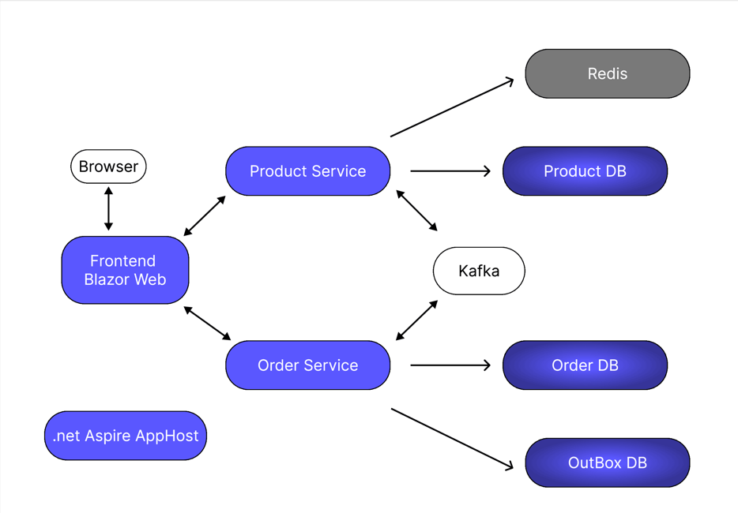

# **E-Commerce app**
<p align="center">
  
</p>

## **Архитектура проекта**
Проект разработан на основе **.NET 8** с использованием современных архитектурных подходов и включает в себя четыре основных компонента:

### **AppHost (.NET Aspire)**  
- Управляет жизненным циклом всех сервисов и их зависимостями.
- Обеспечивает мониторинг и трассировку работы всех компонентов.
- Объединяет логику взаимодействия между микросервисами.
- Позволяет управлять конфигурацией, масштабированием и безопасностью.

### **Web (Frontend)**  
- Реализован на **Blazor**.
- Отвечает за пользовательский интерфейс и отправку запросов к микросервисам **ProductService** и **OrderService**.

### **ProductService (Микросервис товаров)**  
- Взаимодействует с **Web (Blazor)** и **OrderService**.
- Реализован потребитель (**Consumer**) событий **Kafka**.
- Для идемпотентности используется **Redis Cache**.
- База данных — **PostgreSQL**, взаимодействие через **EF Core** и **ADO.NET**.
- Валидация данных с помощью **FluentValidation**.
- Логирование через **Serilog**.
- Мониторинг и трассировка через **OpenTelemetry + Jaeger**.

### **OrderService (Микросервис заказов)**  
- Взаимодействует с **Web (Blazor)** и **ProductService**.
- Реализован **Producer** событий **Kafka**.
- Использует **Outbox Pattern** для надежной отправки сообщений в **Kafka**.
- База данных — **PostgreSQL**, взаимодействие через **EF Core** и **ADO.NET**.
- Валидация входных данных с помощью **FluentValidation**.
- Логирование через **Serilog**.
- Мониторинг и трассировка через **OpenTelemetry + Jaeger**.

## **Основные технологии и подходы**
- **MediatR + CQRS** — в каждом микросервисе используется паттерн **CQRS** с **MediatR** для разделения команд и запросов.  
- **Kafka** — асинхронное взаимодействие между микросервисами (**OrderService — Producer, ProductService — Consumer**).  
- **Outbox Pattern** — реализован в **OrderService** для гарантированной отправки сообщений в **Kafka**.  
- **Redis Cache** — используется в **ProductService** для идемпотентной обработки входящих событий.  
- **PostgreSQL** — основная база данных для хранения информации о товарах и заказах.  
- **EF Core + ADO.NET** — для взаимодействия с базой данных.  
- **FluentValidation** — для валидации входных данных.  
- **OpenTelemetry + Jaeger** — трассировка запросов и мониторинг производительности.  
- **Serilog** — логирование с отправкой логов в консоль и API.  
- **.NET Aspire** — используется для управления зависимостями и мониторинга сервисов.

## Пособие к запуску
В этом руководстве описаны шаги по развертыванию необходимых зависимостей с использованием Docker и запуску самого приложения.

## Клонирование репозитория
```sh
git clone https://github.com/smellilac/Ecommerce-microservice.git
cd Ecommerce-microservice
```

## Запуск контейнеров с зависимостями

### Kafka и Zookeeper
В проекте Ecommerce.AhhHost есть файл `kafka.yml` и запустите его:
```sh
docker-compose -f kafka.yml up -d
```

### Jaeger (для распределенного трейсинга)
```sh
docker run -d --name jaeger \
    -e COLLECTOR_ZIPKIN_HTTP_HTTP_PORT=9411 \
    -p 5775:5775 -p 6831:6831/udp -p 6832:6832/udp \
    -p 5778:5778 -p 16686:16686 -p 14252:14252 \
    -p 14268:14268 -p 14251:14251 -p 9411:9411 \
    jaegertracing/all-in-one:1.32
```

Jaeger UI будет доступен по адресу: [http://localhost:16686](http://localhost:16686)

### Redis (для кеширования)
```sh
docker run --name myredis -p 6379:6379 -d redis
```


## Проверка работы контейнеров
```sh
docker ps
```

## Остановка всех контейнеров
```sh
docker-compose down